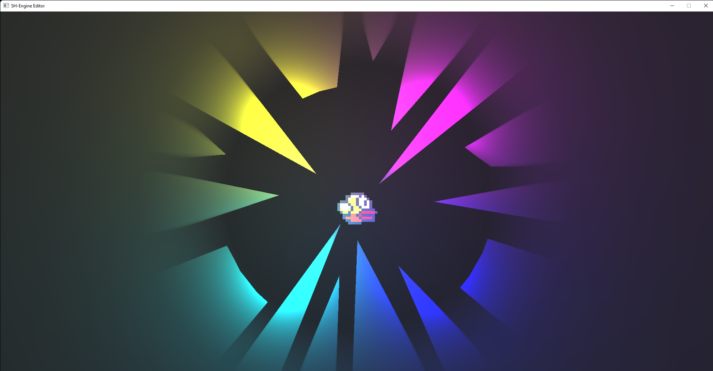

# shengine

A cross-platform Vulkan engine made for personal projects written completely in C. It's not a plug-and-play 3d engine, but a series of libraries and programs build to speed the creation of vulkan based applications and applications in general. The engine is on active development.

---

# [Build status](./shci)

The engine is frequently being tested on Windows 11, Linux Mint (virtual machine and pc) with different compilers (`MSVC`, `gcc`), and hardware configurations (`RX580 4GB GDDR5`, `Radeon V Carrizo 500MB`).

---

# Notes
 - Python 3.9 is required to generate the project files
 - It's better for me to stick with a few and simple examples: `triangle` and `noise` 
 - Dismissed `flappy-circle`, `application-sample`, `serial-sample`
 - UI is on active development, shgui needs to be rewritten with a different approach
 - Texture examples to do
 - Audio to do

---

# Documentation
 * [`Project guide`](./docs/project-guide.md)
 * [`Native scripting`](./docs/native-scripting.md)

---

# Features
 - By default double buffering.
 - Depth buffer and multisampling support by default.
 - Native scripting in C (see [`docs/native-scripting`](./docs/native-scripting.md)).
 - Multithreading using [`shthreads`](https://github.com/mrsinho/shthreads) (see [`docs/native-scripting`](./docs/native-scripting.md)).
 - Serial communication with [`shserial`](https://github.com/mrsinho/shserial).
 - Ply mesh loader using [`plyimporter`](https://github.com/mrsinho/plyimporter).
 - CMake project generation by running the `export-application.py` program (see [`docs/project-guide`](./docs/project-guide.md#generate-projects)).
- Usage of [`.smd`](https://github.com/mrsinho/smd) files (see [`docs/project-guide`](./docs/project-guide.md#smd-files))
- Vulkan API implementation using [`shvulkan`](https://github.com/mrsinho/shvulkan). The responsibility of the developer stands on creating a pipeline building system and GPU calls. Command buffer synchronization for swapchain images and presentation is automatically handled by the engine.

---
