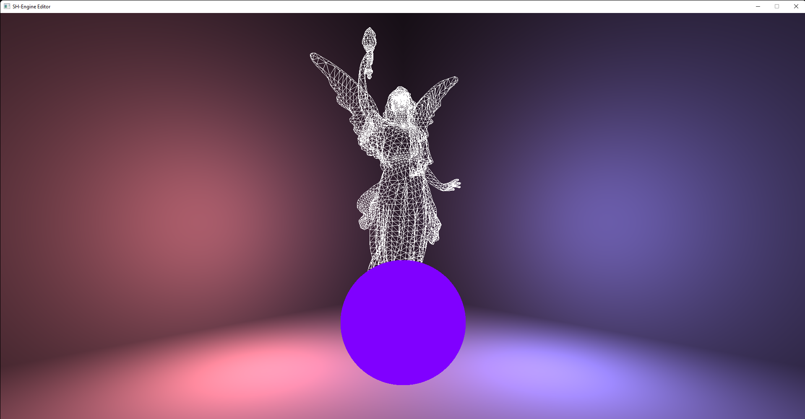

# SH-Engine

[Build status](#build-status)

[Current features](#current-features)
* [To do](#to-do)

[Build from source](#build-from-source)
* [Engine targets only](#engine-targets-only)
* [simulation-sample](#simulation-sample)
* [flappy-circle](#flappy-circle)
* [serial-demo](#serial-demo)
   * [Pinout for the Raspberry Pi pico and UF2 binary](#pinout-for-the-raspberry-pi-pico-and-uf2-binary)

---

# [Build status](https://github.com/MrSinho/Foggy-Engine/tree/main/.ShCI)

[](https://github.com/MrSinho/Sh-Engine/tree/main/.ShCI/linux-log.md)
[](https://github.com/MrSinho/Sh-Engine/tree/main/.ShCI/windows-log.md)

The engine has been tested on Windows 10, Linux Mint (virtual machine) and Ubuntu with different compilers (`MSVC`, `gcc`), and hardware configurations (`RX580 4GB GDDR5`, `Radeon V Carrizo 500MB`).


# Current features:
 - Entity Component System using [shecs](https://github.com/MrSinho/shecs)
 - Full glsl shader customization
 - Ply mesh loader using [plyimporter](https://github.com/MrSinho/plyimporter)
 - Depth buffer support
 - Serial communication using [shserial](https://github.com/MrSinho/shserial)
 - Scene creation and customization by setting up a scene.json file
 - Custom shader handling (more about that in the Coulomb shader and example)
    * define shader general properties in materials.json
    * set up shader input parameters for each entity (if required) in scene.json
    * material extension structures support
 - Native scripting in C:
    * simulation.json sets up some properties for a shared library, which functions are called in runtime
    * to generate the cmake target given the external application name, run export-simulation.py

## To do:
 * Multithreaded rendering
 * Compute Shaders
 * Double/triple buffering
 * Textures
 * Audio

---

# Build from source

```bash
git clone --recursive https://github.com/MrSinho/SH-Engine
cd SH-Engine
``` 

## Engine targets only

```bash
mkdir build
cd build 
cmake ..
cmake --build .
```

---

## simulation-sample

Just a random scene.



```batch
python export-simulation.py "simulation-sample" SHARED
cd build 
cmake --build .
```

---

## flappy-circle

A Flappy Bird clone in a circular map. Press `SPACE` to let it survive.


```batch
python export-simulation.py "flappy-circle" SHARED
cd build 
cmake --build .
```

---

## serial-demo

Any variation of analog input for the Raspberry Pi Pico affects the lighting in the scene.


```batch
python export-simulation.py "serial-demo" SHARED
cd build 
cmake --build .
```
Note: because the simulation does not include multithreading, reading serial data blocks all gpu calls.

## Pinout for the Raspberry Pi Pico and UF2 binary
It's connected to a `1.5V` solar panel (it could be a potentiometer or any analogic sensor). The negative charged cable (in red) is connected to `ADC input 0`, `GPIO 26`. The program to run on the Raspberry Pi Pico is located at [simulations/serial-demo/pico-bin/shengine_sample_raw.uf2](simulations/serial-demo/pico-bin/shengine_sample_raw.uf2).

You should correct the serial port name in case the one at [simulations/serial-demo/src/serial-demo.c](simulations/serial-demo/src/serial-demo.c) doesn't match.


---

# Binaries and output

The built targets are in the `bin` directory.
