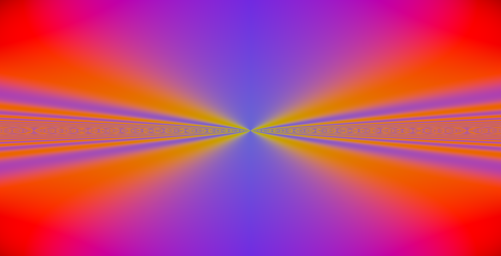
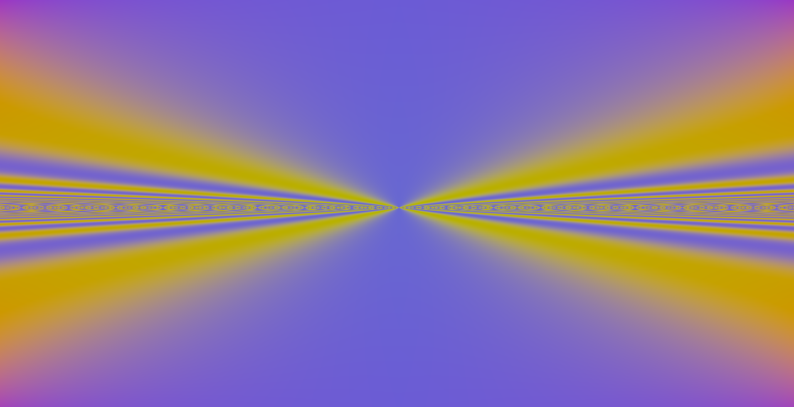

# Noise application example

*_Check the linux and windows build logs:_*

[](../.shci/linux/log.md)
[](../.shci/windows/log.md)


Using Windows (run as admin):
```bash
python export-application.py name=noise target=EXECUTABLE path=applications/noise
cd applications/noise/windows/build
cmake --build .
cp ../../ini.smd ../bin/ini.smd
```

Using Linux:
```bash
sudo python3.9 export-application.py name=noise target=EXECUTABLE path=applications/noise
cd applications/noise/linux/build
sudo cmake --build .
sudo cp ../../ini.smd ../bin/ini.smd
```

## Application tour

To change the values of the parameters `S` `A` and `B`:

|Parameter    |Increase key    |Decrease key    |
|-------------|----------------|----------------|
| `S`         |       _W_      |       _Q_      |
| `A`         |       _S_      |       _A_      |
| `B`         |       _X_      |       _Z_      |

Fragment shader algorithm:

$$c = \cos(\pi x y s)$$

$$
RGB_{raw} = \begin{bmatrix}
\sin(\pi|x|\cfrac{s}{a}) + c\\
\sin(\pi|y|\cfrac{s}{b}) + c\\
\cos(\pi\cfrac{x}{y}s) + c\\
\end{bmatrix}
$$

Every 2 seconds the parameters values get saved at [`noise-interface.smd`](../applications/noise/smd/noise-interface.smd), which is a text-based interface written in an [`smd`](https://github.com/mrsinho/smd) format, from which you can read the parameters values in runtime. You can export these values to [`noise-saved.smd`](../applications/noise/smd/noise-saved.smd) by pressing `LEFT_CTRL` + `E`. When the application is reloaded (`LEFT_CTRL` + `R`) the default parameters written at [`noise-recovery.smd`](../applications/noise/smd/noise-recovery.smd) will be read. You can load the exported values by pressing `LEFT_CTRL` + `L`.

---

$s = \cfrac{1}{2}$

$a = 1$

$b = -2,5$



---

$s = \cfrac{1}{2}$

$a = 1$

$b = -2,5$



---

$s = 4$

$a = 4,5$

$b = -1,8$


---

$s = 4$

$a = 5$

$b = 7$


---

